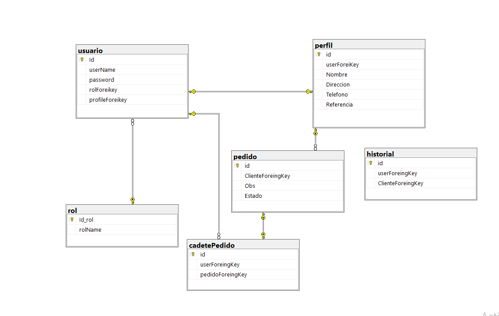

# Proyecto React-asp .net

En esta parte vamos a cubrir los temas finales que no se vieron en la anteiores partes. Vamos a fusionar ambos trabajos y adaptarlos para que tenga sentidos.

## Fusion de los dos proyectos.

Comencemos con la fusion. Como ya se dieron cuenta ambos proyectos se crearon de manera separada a pesar de ser todo parte de un solo trabajo final. Si hicieron todo de manera separada al final tendran dos versiones que necesitan unificarse. No obstante, tenemos dos repositorios diferentes.

>Nota: si trabajaste en el mismo trabajo y quieres probar este ejercicio solo tienes que descargar los repositorios que dejo en aqui [link 1](https://github.com/leandroVece/React-Asp.net) [link 2](https://github.com/leandroVece/React-Asp.net-2).

>nota: en el repo dos termine subiendo la carpeta en vez de los archivos, por lo que tendran que entrar en la carpeta y recien iniciar los pasos(Dentro de la carpete).

Para comenzar necesitamos que ambos repositorios locales apunte a un mismo repositorio remoto. Para ello existe el siguiente comando.

    git remote add <name> https://...

Si ya tienes la sana costumbre de guardar tus repositorios en la nuve, sabras que cuando agregamos un repositorio remoto a nuestro proyectos locales tenemos que expecificar la ruta, como esta el ejemplo de arriba.

Para evitar perder el progreso, recomiendo clonar el repositorio uno y dos. Luego crear un tercer repositorio y agregar la direccion remota del nuevo repositorio. Para eso necesitaremos eliminar la referencia al anterior repositorio, para evitar perder el progreso.

    git remote rm <name>

Luego agregagaremos la nueva referencia y subir ambos proyectos como si fueran ramas en el mismo repositorio. Si eres un poco mas experimentado, no necesitaras hacer todo esto, pero si no sabes mucho sobre Git recomiendo hacer esto para evitar las perdidas.

De este punto lo unico que debes hacer es un git pull para obtener los cambios de la rama que te falta en el repositorio que elegiste quedar. Si no entiendes demaciado, simplemente clona el nuevo repositorio y comencemos a trabajar.

En el repositorio que decidiste quedarte vamos a hacer un merge para fusionar ambos trabajos. En mi caso, use el pull para atraer desde mi rama main.

    git pull origin segunda --allow-unrelated-histories 

Luego de solucionar los conflicto escribi el siguiente comando.

    Dotnet buil

El cual se encargo de restaurar todas las dependecias que necesitaba el proyecto. Seguramente tendras que intalar de nuevo el paquete de universal-cookies. luego deberia andar mas o menos bien.

## Preparacion de base de datos.

Como el trabajo hasta aqui fue puramente descriptivo, hubo uso de algunas malas practicas para poder entender mejor el uso de ls buenas practicas. Ahora que fusionamos dos proyectos y resolvimos sus conflictos entendimos un poco mas sobre la necesidad de seguir una idea en comun.

Comencemos con planificar la base de datos correctamente. Si queremos mantener los modelos con cambios minimos vamos a tener que renombrar y repplantear las relaciones entre tablas. Por ejemplo, el nombre no es necesario que este en las tablas de clientes o Clientes. Pero puede mantenerse, a cambios vamos a tener que renombrar la tabla de usuario para que no espere un nombre, sino un userName o un correo.

Sin embargo esto implica un problema, porque para mantener tales tablas, vamos a necesitar borrar la tabla de roles y hacer algunos cambios en los pedidos.

Otra alternativa es borra uno de estos dos campos, que tienen los mismos valores y renombrar el otro como Profile. de aqui obtendremos datos de perfil del usuario. permitiendonos conservar gran parte de lo que trabajamos.

En esta nueva base de datos, vemos que en vez de acceder a los datos de los clientes o de los cadetes, solo tenemos que acceder a los datos del perfil de los usuarios involucrados.
Tambien cambiamos una tabla que no tiene relacion, debido a que el cliente y el cadete son parte de una misma tabla, por lo que vamos a dejarlo por ahora.

>Nota: dejo en esta ocacion la imagen ya que fue explicado con anterioridad como crear una base de datos, el trabajo tiene modificaciones minima debido a que se hizo con fines practicos. Un codigo con buenas practicas no necesita ser modificado, simplemente agregaremos nuevas funciones sobre las que ya cuenta.

## Creacion de perfil.

Ahora que la informacion de los cadetes y los clientes son parte del perfil, ahora tenemos que cambiar la forma de editar y crear nuevos cadetes y clientes. Antes usabamos un Crud simple para hacer las 4 operaciones, Ahora no tiene sentido que se haga de esa manera. Primero porque tenemos que dejar que los propios usuarios puedan cambiar sus datos y segundo es porque no tiene sentido tener dos formas distintas de hacer lo mismo.

Vamos a crear un nuevo componente llamado profile y lo agregaremos a nuestro array de rutas, luego En nuestro.
**Path:AppClient/src/components/profile/index.js**

    import React from "react";
    import { AuthRouter, useAuth } from "../Auth";
    import { useNavigate } from "react-router-dom";
    import './style.css';

    const Profile = () => {
        const auth = useAuth();
        const navigate = useNavigate();
        auth.setUrl("/profile/" + auth.cookies.get('id'))

        const handelEdit = (data) => {
            delete data.userName
            delete data.userForeiKey
            console.log(data)
            navigate("/formProfile", { state: { data } })
        }

        return (
            <>
                <AuthRouter>
                    

                        <h1 className="text-center text-white">Perfil</h1>.
                    

                    

                        

                            

                                

                                    

                                        

                                            

                                                

                                                    

                                                        
                                                    

                                                    <h6 className="f-w-600">{auth.dbUser[0] ? auth.dbUser[0].nombre : 'Nombre'}</h6>
                                                    
 handelEdit(auth.dbUser[0])}>Editar

                                                    <i className=" mdi mdi-square-edit-outline feather icon-edit m-t-10 f-16"></i>
                                                

                                            

                                            

                                                

                                                    <h6 className="m-b-20 p-b-5 b-b-default f-w-600">Information</h6>
                                                    

                                                        

                                                            
Nombre

                                                            <h6 className="text-muted f-w-400">{auth.dbUser[0] ? auth.dbUser[0].nombre : 'Nombre'}</h6>
                                                        

                                                        

                                                            
Phone

                                                            <h6 className="text-muted f-w-400">{auth.dbUser[0] ? auth.dbUser[0].telefono : 'telefono'}</h6>
                                                        

                                                    

                                                    <h6 className="m-b-20 m-t-40 p-b-5 b-b-default f-w-600">Datos</h6>
                                                    

                                                        

                                                            
Direccion

                                                            <h6 className="text-muted f-w-400">{auth.dbUser[0] ? auth.dbUser[0].direccion : 'Direccion'}</h6>
                                                        

                                                        

                                                            
Nombre Usuario

                                                            <h6 className="text-muted f-w-400">{auth.dbUser[0] ? auth.dbUser[0].userName : 'Nombre Usuario'}</h6>
                                                        

                                                    

                                                    <ul className="social-link list-unstyled m-t-40 m-b-10">
                                                        <li><a href="#!" data-toggle="tooltip" data-placement="bottom" title=""
                                                            data-original-title="facebook" data-abc="true"><i
                                                                className="mdi mdi-facebook feather icon-facebook facebook"
                                                                aria-hidden="true"></i></a></li>
                                                        <li><a href="#!" data-toggle="tooltip" data-placement="bottom" title=""
                                                            data-original-title="twitter" data-abc="true"><i
                                                                className="mdi mdi-twitter feather icon-twitter twitter"
                                                                aria-hidden="true"></i></a></li>
                                                        <li><a href="#!" data-toggle="tooltip" data-placement="bottom" title=""
                                                            data-original-title="instagram" data-abc="true"><i
                                                                className="mdi mdi-instagram feather icon-instagram instagram"
                                                                aria-hidden="true"></i></a></li>
                                                    </ul>
                                                

                                            

                                        

                                    

                                

                            

                        

                    

                </AuthRouter>
            </>
        );
    }

    export default Profile;

>Nota: Los estilos estan en el archivo css junto  a la carpeta que contiene el componente de perfil.
**Path:AppClient/src/components/profileForm/index.js**

    import React, { useState, useEffect } from "react"
    import Input from "./Input";

    import "./form.css"
    import { useAuth } from "../Auth";
    import { useLocation, useNavigate } from "react-router-dom";

    const InitialForm = {
        id: null,
        nombre: "",
        direccion: "",
        telefono: "",
        referencia: ""
    }

    const FormProfile = () => {
        const auth = useAuth()
        auth.setUrl("/profile")
        const [form, setForm] = useState(InitialForm);
        const [img, setImg] = useState("")
        const { state } = useLocation();
        const nav = useNavigate();

        useEffect(() => {
            if (state['data'].rolName == "cadete") {
                setImg("./img/cadete.png")
            } else {
                setImg("./img/pedido.jpg")
            }
            if (state['data']) {
                setForm(state['data']);
            } else {
                setForm(InitialForm);
            }
        }, [auth.url])

        let array = Object.getOwnPropertyNames(form)

        const handleSubmit = (e) => {
            e.preventDefault();
            if (form.id == null) {
                auth.createWithToken(form)
            } else {
                auth.UpdateWithToken(form);
            }
            handleReset();
        };

        const handleChange = (e) => {
            setForm({
                ...form,
                [e.target.name]: e.target.value,
            });
        };

        const handleReset = () => {
            setForm(InitialForm);
            nav('/profile')
        };

        return (
            <section className="gradient-form" >
                

                    

                        

                            

                                

                                    

                                        

                                            

                                                
                                                <h4 className="mt-1 mb-5 pb-1">We are The [name] Team</h4>
                                            

                                            <form onSubmit={handleSubmit}>
                                                {array.map((d, index) => {
                                                    if (d === 'id') return
                                                    else {
                                                        return (
                                                            

                                                                <Input
                                                                    placeholder={d}
                                                                    name={d}
                                                                    value={form[d]}
                                                                    handleChange={handleChange}
                                                                />
                                                            

                                                        );
                                                    }
                                                })}
                                                

                                                    <input className="btn btn-outline-danger" type="reset" value="Limpiar" onClick={handleReset} />
                                                    <input className="btn btn-outline-danger" type="submit" value="Enviar" />
                                                

                                            </form>
                                        

                                    

                                    

                                        

                                            <h4 className="mb-4">We are more than just a company</h4>
                                            
Lorem ipsum dolor sit amet, consectetur adipisicing elit, sed do eiusmod
                                                tempor incididunt ut labore et dolore magna aliqua. Ut enim ad minim veniam, quis nostrud
                                                exercitation ullamco laboris nisi ut aliquip ex ea commodo consequat.

                                        

                                    

                                

                            

                        

                    

                

            </section >
        )
    }

    export default FormProfile;

Ahora que no tenemos que reciclar el codigo dependiendo si era un cadete o un cliente, podriamos hacer un formulario dedicado a solo editar y crear un perfil. Yo solo voy a reciclar el codigo, para no generar cambios.
**Path:Controller/ProfileController.cs**

    using Cadeteria.Authorization;
    using Cadeteria.Models;
    using Microsoft.AspNetCore.Mvc;

    namespace Cadeteria;

    [Authorize]
    [ApiController]
    [Route("[controller]")]
    public class ProfileController : ControllerBase
    {
        private readonly IProfileRepository _dbProfile;
        private readonly DataContext _db;
        private readonly ILogger<ProfileController> _logger;

        public ProfileController(ILogger<ProfileController> logger, DataContext db, IProfileRepository Profile)
        {
            _dbProfile = Profile;
            _db = db;
            _logger = logger;
        }

        [HttpGet]
        public IActionResult Get()
        {
            return Ok(_dbProfile.Get());
        }

        [HttpGet("{id}")]
        public IActionResult GetById(Guid id)
        {
            var response = _db.Users.Join(_db.Profile, u => u.Id, p => p.userForeiKey,
            (u, p) => new { u.userName, p.userForeiKey, p.id, p.Nombre, p.Direccion, p.Telefono, p.Referencia })
            .Where(x => x.userForeiKey == id);
            return Ok(response);
        }
        [HttpPost]
        public IActionResult Post([FromBody] Profile Profile)
        {
            _dbProfile.Save(Profile);
            return Ok();
        }

        [HttpPut("{id}")]
        public IActionResult Put(Guid id, [FromBody] Profile Profile)
        {
            _dbProfile.Update(id, Profile);
            _dbProfile.Save(Profile);
            return Ok();
        }

    }

Como pueden ver el controlador de nuestro perfil no tiene una funcion de Eliminar. La razon es simple, no lo necesita. No tiene sentido borrar un perfil y mantener el usuario, por lo que necesitamos borrar el perfil Cuando borremos el Usuario, para ello vamos a borrar en cascada.
En anterioridad lo deje como comentario aunque no lo mostre, ahora vamos a explicarlo un poco mas.
**Path:/Helpers/DataContext.cs**

    modelBuilder.Entity<User>(User =>
    {

        User.ToTable("usuario");
        User.HasKey(User => User.Id);
        User.Property(User => User.userName).IsRequired().HasMaxLength(15).IsUnicode();
        User.Property(User => User.password).IsRequired().HasMaxLength(80);

        User.HasOne(r => r.Rol).WithMany(us => us.User).HasForeignKey(r => r.rolForeikey);

        User.HasData(listaDb.ListUser());
    });

    modelBuilder.Entity<Profile>(profile =>
    {
        profile.ToTable("perfil");
        profile.HasKey(p => p.id);
        profile.Property(p => p.id).IsRequired().ValueGeneratedOnAdd();

        profile.Property(p => p.Nombre).IsRequired().HasMaxLength(20);
        profile.Property(p => p.Direccion).IsRequired().HasMaxLength(100);
        profile.Property(p => p.Telefono).IsRequired().HasMaxLength(20);
        profile.Property(p => p.Referencia);

        profile.HasOne(us => us.User).WithOne(p => p.Profile)
        .HasForeignKey<Profile>(p => p.userForeiKey)
        .OnDelete(DeleteBehavior.Cascade);

        profile.HasData(listaDb.listaPerfil());
    });

Para que la relacion se cree perfectamente y se comporte como deseamos, no podesmos crear la relacion de dependencia en cualquier lado. La relacion se tiéne que crear en la entidad que esperamos borrar cuando la entidad dependiente. En este caso, la entidad independiente es el Usuario y la entidad dependiente es el Perfil.

## Paginacion

Vamos a usar el trabajo de [Fernando Calmet](https://github.com/FernandoCalmet/dotnet-6-aspnet-core-webapi-pagination).

Para obtener un número específico de registros de la tabla, podemos usar LINQ con los métodos **Skip()** y **Take()**.
El metodo **Take()** extrae los primeros nelementos (donde nes un parámetro del método) desde el comienzo de la secuencia de destino y devuelve una nueva secuencia que contiene solo los elementos tomados.
El Skip()método puede considerarse exactamente lo contrario del **Take()**. Mientras que **Take()** devuelve una secuencia que contiene los primeros n Skip()

Como el trabajo esta bastante bien esplicado, simplemente voy a usar una forma muy simplificada siguiendo este trabajo.

Comencemos a por ir a nuestro servicios de usuarios y creemos un nuevo metodo que llame las tres tablas y la convierta en un objeto.

**path:services/repositories/UserRepository.cs**

    public List<JoinResponse> GetUserJoin(int page)
    {
        List<JoinResponse> data = new List<JoinResponse>();

        var pagedData = _context.Users.Join(_context.rols, us => us.rolForeikey, r => r.Id,
            (us, r) => new { us.Id, us.userName, us.rolForeikey, r.rolName })
            .Join(_context.Profile, us => us.Id, pr => pr.userForeiKey, (us, p) => new
            { us.rolName, p.id, p.userForeiKey, p.Direccion, p.Telefono, p.Nombre, p.Referencia })
            .Skip((page - 1) * 1)
            .Take(1);

        foreach (var item in pagedData)
        {
            data.Add(new JoinResponse()
            {
                Id = item.id,
                userForeiKey = item.userForeiKey,
                Direccion = item.Direccion,
                Nombre = item.Nombre,
                Referencia = item.Referencia,
                Telefono = item.Telefono,
                rolName = item.rolName
            });
        }

        return data;
    }

    public List<JoinResponse> GetUserJoinAndWhere(int page, string condicion)
    {

        List<JoinResponse> data = new List<JoinResponse>();

        var pagedData = _context.Users.Join(_context.rols, us => us.rolForeikey, r => r.Id,
        (us, r) => new { us.Id, us.userName, us.rolForeikey, r.rolName })
        .Join(_context.Profile, us => us.Id, pr => pr.userForeiKey, (us, p) => new
        { us.rolName, p.id, p.userForeiKey, p.Direccion, p.Telefono, p.Nombre, p.Referencia })
        .Where(x => x.rolName == condicion)
        .Skip((page - 1) * 1)
        .Take(1);

        foreach (var item in pagedData)
        {
            data.Add(new JoinResponse()
            {
                Id = item.id,
                userForeiKey = item.userForeiKey,
                Direccion = item.Direccion,
                Nombre = item.Nombre,
                Referencia = item.Referencia,
                Telefono = item.Telefono,
                rolName = item.rolName
            });
        }

        return data;
    }

Como podemos ver, uso un Forech para pasar parametro por parametro a un nuevo objeto, lo correcto seria hacer uso de dos o mas Mapper para convertirlo, pero por falta de tiempo lo dejo de esta manera.

**Path:Model/user/JoinRespose.cs**

    using System.ComponentModel.DataAnnotations.Schema;
    using System.Text.Json.Serialization;

    namespace Cadeteria.Models;

    public class JoinResponse
    {
        public Guid Id { get; set; }
        public Guid userForeiKey { get; set; }
        public string rolName { get; set; }
        public string Direccion { get; set; }
        public string Telefono { get; set; }
        public string Nombre { get; set; }
        public string Referencia { get; set; }

    }

Con esto podemos invocarlo en nuestro controlador.

**Path:Controllers/UserControllers.cs**

    namespace Cadeteria.Controllers;

    using AutoMapper;
    using Microsoft.AspNetCore.Mvc;
    using Microsoft.Extensions.Options;
    using Cadeteria.Authorization;
    using Cadeteria.Models;
    using Cadeteria.Services;
    using System.Collections;

    [Authorize]
    [ApiController]
    [Route("[controller]")]
    public class UserController : ControllerBase
    {
        private IUserRepository _userRepository;
        DataContext _db;
        private IMapper _mapper;
        private readonly AppSettings _appSettings;

        public UserController(
            IUserRepository userService,
            DataContext db,
            IMapper mapper,
            IOptions<AppSettings> appSettings)
        {
            _userRepository = userService;
            _db = db;
            _mapper = mapper;
            _appSettings = appSettings.Value;
        }

        [AllowAnonymous]
        [HttpPost("authenticate")]
        public IActionResult Authenticate(AuthenticateRequest model)
        {
            var response = _userRepository.Authenticate(model);
            //SetSesion(response);
            return Ok(response);
        }

        [AllowAnonymous]
        [HttpPost("register")]
        public IActionResult Register(RegisterRequest model)
        {
            _userRepository.Register(model);
            return Ok(new { message = "Registration successful" });
        }

        [HttpGet]
        public IActionResult GetAll()
        {
            int page = 1;
            var pagedData = _userRepository.GetUserJoin(page);

            var totalRecords = _db.Users.Join(_db.rols, us => us.rolForeikey, r => r.Id,
            (us, r) => new { us.Id, r.rolName }).Count();
            return Ok(new PagedResponse<IEnumerable<JoinResponse>>(
                pagedData, totalRecords / 1, page));
        }

        [HttpGet]
        [Route("page/{page}")]
        public IActionResult GetPage(int page = 1)
        {
            List<JoinResponse> pagedData = _userRepository.GetUserJoin(page);

            var totalRecords = _db.Users.Join(_db.rols, us => us.rolForeikey, r => r.Id,
            (us, r) => new { us.Id, r.rolName }).Count();
            return Ok(new PagedResponse<IEnumerable<JoinResponse>>(
                pagedData, totalRecords / 1, page));
        }

        [HttpGet]
        [Route("cadete")]
        public IActionResult GetCadete()
        {
            int page = 1;
            var pagedData = _userRepository.GetUserJoinAndWhere(page, "cadete");

            var totalRecords = _db.Users.Join(_db.rols, us => us.rolForeikey, r => r.Id,
            (us, r) => new { us.Id, r.rolName }).Where(x => x.rolName == "cadete").Count();
            return Ok(new PagedResponse<IEnumerable<JoinResponse>>(
                pagedData, totalRecords / 1, page));
        }

        [HttpGet]
        [Route("cadete/page/{int}")]
        public IActionResult GetCadetepage(int page = 1)
        {
            var pagedData = _userRepository.GetUserJoinAndWhere(page, "cadete");

            var totalRecords = _db.Users.Join(_db.rols, us => us.rolForeikey, r => r.Id,
            (us, r) => new { us.Id, r.rolName }).Where(x => x.rolName == "cadete").Count();
            return Ok(new PagedResponse<IEnumerable<JoinResponse>>(
                pagedData, totalRecords / 1, page));
        }

        [HttpGet]
        [Route("cliente")]
        public IActionResult GetCliente()
        {
            int page = 1;
            var pagedData = _userRepository.GetUserJoinAndWhere(page, "cliente");

            var totalRecords = _db.Users.Join(_db.rols, us => us.rolForeikey, r => r.Id,
            (us, r) => new { us.Id, r.rolName }).Where(x => x.rolName == "cliente").Count();
            return Ok(new PagedResponse<IEnumerable<JoinResponse>>(
                pagedData, totalRecords / 1, page));
        }
        [HttpGet]
        [Route("cliente/page/{page}")]
        public IActionResult GetClientePage(int page = 1)
        {
            var pagedData = _userRepository.GetUserJoinAndWhere(page, "cliente");

            var totalRecords = _db.Users.Join(_db.rols, us => us.rolForeikey, r => r.Id,
            (us, r) => new { us.Id, r.rolName }).Where(x => x.rolName == "cliente").Count();
            return Ok(new PagedResponse<IEnumerable<JoinResponse>>(
                pagedData, totalRecords / 1, page));
        }

        [HttpGet("rol")]
        public IActionResult GetAllRol()
        {
            var rol = _userRepository.GetAllRol();
            return Ok(rol);
        }

        [HttpPut("{id}")]
        public IActionResult Update(Guid id, UpdateRequest model)
        {
            _userRepository.Update(id, model);
            return Ok(new { message = "User updated successfully" });
        }

        [HttpDelete("{id}")]
        public IActionResult Delete(Guid id)
        {
            _userRepository.Delete(id);
            return Ok(new { message = "User deleted successfully" });
        }
    }

Ahora solo nos faltaria cambiar un poco la logica de nuestros compoenentes para obtener los diversos valores y a su vez crear un nuevo componente que paginara nuestras consultas.

**Path:ClientApp/src/components/user/index.js**

    import React, { useEffect } from "react";
    import { AuthRouter, useAuth } from "../Auth";
    import TableRow from "../TableRow";
    import { GlobalContext } from "../../ApiContext"
    import Loader from "../Loader"
    import Paginacion from "../Paginacion";
    import { useParams } from "react-router-dom";

    const Usuarios = () => {
        const auth = useAuth();
        const param = useParams()

        if (param?.usuarioPage) {
            auth.setUrl(`user/page/${param?.usuarioPage}`)
        }
        else
            auth.setUrl('/user')

        const {
            loading,
        } = React.useContext(GlobalContext)

        return (
            <>
                <AuthRouter>
                    

                        <h1 className="text-center text-white">Seccion solo de administradores</h1>.
                    

                    <h2>Esta solo se vera para cadetes o administradores</h2>

                    {auth.loading && <Loader />}

                    {!auth.loading && auth.dbUser.data && (
                        

                            

                                <table className="table w-75 mx-auto">
                                    <thead>
                                        <tr>
                                            <th className="w-25">Nombre</th>
                                            <th className="w-25">Rol</th>
                                            <th className="w-25">Editar</th>
                                            <th className="w-25">Eliminar</th>
                                        </tr>
                                    </thead>
                                    <tbody>
                                        {auth.dbUser.data.length > 0 ? (
                                            auth.dbUser.data.map((user, index) =>
                                                < TableRow
                                                    key={index}
                                                    user={user}
                                                    deleteWithToken={auth.deleteWithToken}
                                                />
                                            )) : (
                                            <tr>
                                                <td colSpan="2">Sin datos</td>
                                            </tr>)}
                                    </tbody>
                                </table>

                            

                            < Paginacion
                                totalPages={auth.dbUser.totalPages}
                                param={auth.dbUser.pageNumber}
                                url={"usuarios"}
                            />
                        
)
                    }
                </AuthRouter>
            </>
        );
    }

    export default Usuarios;

>Nota: Como siempre solo mostrare uno, el resto queda a disposicion de cada uno

**Path:ClientApp/src/components/paginacion/index.js**

    import React, { useEffect, useState } from "react";
    import { useAuth } from "../Auth";
    import { useNavigate } from "react-router-dom";

    const Paginacion = ({ totalPages, param, url }) => {

        const auth = useAuth();

        const [boton, setBoton] = useState([]);
        const [pageNumber, setpageNumber] = useState(param)
        const nav = useNavigate();

        function cargarArray(inicial, final) {
            let array = []
            for (let index = inicial; index <= final; index++) {
                array.push(index)
            }
            return array
        }

        useEffect(() => {
            let arrayCargado = []
            if (pageNumber < 6 && totalPages < 6) {
                arrayCargado = arrayCargado.concat(cargarArray(1, totalPages))
                setBoton(arrayCargado)
                return
            }
            if (pageNumber + 4 >= totalPages) {
                arrayCargado.push(1)
                arrayCargado.push("...")
                arrayCargado = arrayCargado.concat(cargarArray(totalPages - 4, totalPages))
                setBoton(arrayCargado)
                return
            }
            if (totalPages > 6 && pageNumber > 1) {
                arrayCargado.push(1)
                arrayCargado.push("...")
                arrayCargado = arrayCargado.concat(cargarArray(pageNumber, pageNumber + 3))
                arrayCargado.push("...")
                arrayCargado.push(totalPages)
                setBoton(arrayCargado)
                return
            }
            else {
                arrayCargado = arrayCargado.concat(cargarArray(pageNumber, pageNumber + 3))
                arrayCargado.push("...")
                arrayCargado.push(totalPages)
                setBoton(arrayCargado)
            }
            //solo para que se haga una vez, porque ya habria un nueva recarga al cambiar la url

        }, [pageNumber, totalPages])

        const handelClickMore = () => {
            if (pageNumber <= totalPages)
                setpageNumber(pageNumber + 1)

        }
        const handelClickless = () => {
            if (pageNumber > 1)
                setpageNumber(pageNumber - 1)
        }

        const handelClick = (page) => {
            setpageNumber(page)
        }

        useEffect(() => {
            nav(`/${url}/${pageNumber}`)
        }, [pageNumber])

        useEffect(() => {
            setpageNumber(1)
        }, [url])

        return (
            <>
                <nav aria-label="Page navigation example">
                    <ul className="pagination justify-content-center">
                        <li className="page-item"><a className="page-link" onClick={handelClickless} >Previous</a></li>
                        {boton.map((b, index) => {
                            if (b == "...")
                                return (<li key={index} onClick={handelClick} className="page-link">{b}</li>)
                            if (b == pageNumber) {
                                return (
                                    <li key={index} className="page-item active" aria-current="page">
                                        <a className="page-link" >{b}</a>
                                    </li>)
                            }
                            else
                                return (<li key={"li" + index} onClick={() => handelClick(b)} className="page-item"><a className="page-link" >{b}</a></li>)
                        })}
                        <li className="page-item"><a onClick={handelClickMore} className="page-link" >Next</a></li>
                    </ul>
                </nav>
            </>
        );
    }

    export default Paginacion;

Llegado a este punto solo nos queda corregir algunas acciones, para que la aplicacion se vea de una manera mas profesional. Por ejemplo, no tiene sentido que otro cadete pueda hacer que otros cadetes tomen pedidos, asi mismo no tiene sentido que los clientes puedan hacer pedidos por otros. Por lo que seria mejor hacer una seccion especial para que los cadetes y los clientes cuenten con esos botones desde una parte especial, como por ejemplo el perfil o el menu.
**Path:ClienteApp/src/component/botonProfile/index.js**

    import React from "react";
    import { useAuth } from "../Auth";
    import { useNavigate } from "react-router-dom";

    const Botones = (id) => {

        const auth = useAuth();
        const navigate = useNavigate();
        const idresul = id.id

        const HacerPedido = () => {
            //hacer un pedido
            navigate("/FormPedido", { state: { idresul } })
        }

        const TomarPedido = () => {
            navigate("/TomarPedido", { state: { idresul } })
        }
        const handelRedirect = () => {
            //pedido cancelado/completado
            navigate("/actionPedido", { state: { idresul } })
        }

        if (auth.cookies.get("rol") !== "cliente") {
            return (
                <>
                    

                        <button class="btn bg-c-lite-green text-white"
                            onClick={TomarPedido} type="button">Tomar Pedido</button>
                        <button class="btn bg-c-lite-green text-white"
                            onClick={handelRedirect} type="button"> Cancelar/Entregar</button>
                    

                </>
            )
        } else {
            return (
                <>
                    

                        <button class="btn bg-c-lite-green text-white"
                            onClick={HacerPedido} type="button">Nuevo Pedido</button>
                    

                </>
            )
        }
    }

    export default Botones;

A estos botones lo podemos llamar en nuestro perfil y de esa manera podemos acceder a las funciones que un administrador hacia, pero de manera mas particular.

    **Path:ClienteApp/src/component/Profile/index.js**

    import React from "react";
    import { AuthRouter, useAuth } from "../Auth";

    import './style.css';
    import { useNavigate } from "react-router-dom";
    import Botones from "../BotonProfile/Index";

    const Profile = () => {
        const auth = useAuth();
        const navigate = useNavigate();

        auth.setUrl(`/profile/${auth.cookies.get('id')}`)

        const handelEdit = (data) => {
            delete data.userName
            delete data.userForeiKey
            navigate("/formProfile", { state: { data } })
        }

        const { id, ...res } = auth.dbUser
        return (
            <>
                <AuthRouter>
                    

                        <h1 className="text-center text-white">Perfil</h1>.
                    

                    <Botones
                        id={id}
                    />

                    

                        

                            

                                

                                    

                                        

                                            

                                                

                                                    

                                                        
                                                    

                                                    <h6 className="f-w-600">{auth.dbUser ? auth.dbUser.nombre : 'Nombre'}</h6>
                                                    
 handelEdit(auth.dbUser)}> Editar 
                                                            <svg xmlns="http://www.w3.org/2000/svg" width="16" height="16" fill="currentColor" className="bi bi-pencil" viewBox="0 0 16 16">
                                                                <path d="M12.146.146a.5.5 0 0 1 .708 0l3 3a.5.5 0 0 1 0 .708l-10 10a.5.5 0 0 1-.168.11l-5 2a.5.5 0 0 1-.65-.65l2-5a.5.5 0 0 1 .11-.168l10-10zM11.207 2.5 13.5 4.793 14.793 3.5 12.5 1.207 11.207 2.5zm1.586 3L10.5 3.207 4 9.707V10h.5a.5.5 0 0 1 .5.5v.5h.5a.5.5 0 0 1 .5.5v.5h.293l6.5-6.5zm-9.761 5.175-.106.106-1.528 3.821 3.821-1.528.106-.106A.5.5 0 0 1 5 12.5V12h-.5a.5.5 0 0 1-.5-.5V11h-.5a.5.5 0 0 1-.468-.325z" />
                                                            </svg>
                                                        

                                                    

                                                    <i className=" mdi mdi-square-edit-outline feather icon-edit m-t-10 f-16"></i>
                                                

                                            

                                            

                                                

                                                    <h6 className="m-b-20 p-b-5 b-b-default f-w-600">Information</h6>
                                                    

                                                        

                                                            
Nombre

                                                            <h6 className="text-muted f-w-400">{auth.dbUser ? auth.dbUser.nombre : 'Nombre'}</h6>
                                                        

                                                        

                                                            
Phone

                                                            <h6 className="text-muted f-w-400">{auth.dbUser ? auth.dbUser.telefono : 'telefono'}</h6>
                                                        

                                                    

                                                    <h6 className="m-b-20 m-t-40 p-b-5 b-b-default f-w-600">Datos</h6>
                                                    

                                                        

                                                            
Direccion

                                                            <h6 className="text-muted f-w-400">{auth.dbUser ? auth.dbUser.direccion : 'Direccion'}</h6>
                                                        

                                                        

                                                            
Nombre Usuario

                                                            <h6 className="text-muted f-w-400">{auth.dbUser ? auth.dbUser.userName : 'Nombre Usuario'}</h6>
                                                        

                                                    

                                                    <ul className="social-link list-unstyled m-t-40 m-b-10">
                                                        <li><a href="#!" data-toggle="tooltip" data-placement="bottom" title=""
                                                            data-original-title="facebook" data-abc="true"><i
                                                                className="mdi mdi-facebook feather icon-facebook facebook"
                                                                aria-hidden="true"></i></a></li>
                                                        <li><a href="#!" data-toggle="tooltip" data-placement="bottom" title=""
                                                            data-original-title="twitter" data-abc="true"><i
                                                                className="mdi mdi-twitter feather icon-twitter twitter"
                                                                aria-hidden="true"></i></a></li>
                                                        <li><a href="#!" data-toggle="tooltip" data-placement="bottom" title=""
                                                            data-original-title="instagram" data-abc="true"><i
                                                                className="mdi mdi-instagram feather icon-instagram instagram"
                                                                aria-hidden="true"></i></a></li>
                                                    </ul>
                                                

                                            

                                        

                                    

                                

                            

                        

                    

                </AuthRouter>
            </>
        );
    }

    export default Profile;

Si llegaste hasta aqui te felicito porque completaste, completaste este pequeño curso de desarrollo de app web con Asp.Net y React.js